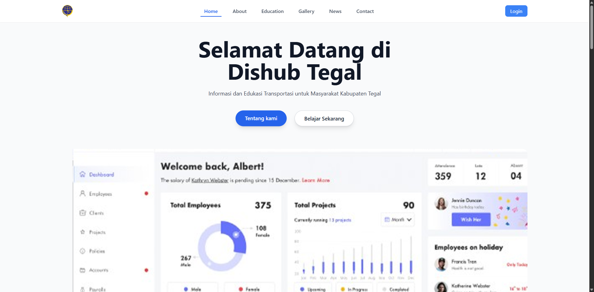

# Dishub Tegal - Website Resmi Dinas Perhubungan Kabupaten Tegal

## Deskripsi

Website resmi Dinas Perhubungan Kabupaten Tegal yang menyediakan informasi dan layanan terkait transportasi untuk masyarakat Kabupaten Tegal. Website ini dibangun menggunakan PHP dan MySQL dengan pendekatan modern dan responsif.

## Preview



## Fitur Utama

1. **Beranda (Home)**

   - Tampilan utama dengan informasi selamat datang
   - Gambar dan deskripsi utama

2. **Tentang Kami (About)**

   - Informasi tentang Dinas Perhubungan
   - Visi dan misi
   - Struktur organisasi

3. **Edukasi**

   - Video edukasi transportasi publik
   - Panduan Uji KIR
   - Materi keselamatan berkendara

4. **Galeri**

   - Koleksi foto kegiatan dan fasilitas
   - Tampilan grid responsif

5. **Berita**

   - Artikel terkait transportasi
   - Sistem manajemen konten
   - Fitur pencarian dan filter

6. **Kontak**
   - Formulir kontak
   - Sistem manajemen pesan
   - Status pembacaan pesan

## Struktur Database

Database terdiri dari beberapa tabel utama:

1. **users**

   - Manajemen pengguna (admin/user)
   - Sistem autentikasi

2. **home**

   - Konten halaman utama
   - Gambar dan deskripsi

3. **about**

   - Informasi tentang institusi
   - Gambar dan konten

4. **education**

   - Materi edukasi
   - Video pembelajaran

5. **gallery**

   - Manajemen galeri foto
   - Judul dan gambar

6. **berita**

   - Artikel berita
   - Sistem slug URL
   - Gambar dan konten

7. **contacts**
   - Pesan dari pengunjung
   - Status pembacaan

## Teknologi yang Digunakan

- PHP 8.4.7
- MySQL 8.4.3
- HTML5
- CSS3
- JavaScript
- Tailwind CSS
- Gsap
- CodeMirror
- Flowbite

## Sistem Animasi

Website ini menggunakan GSAP (GreenSock Animation Platform) untuk menciptakan animasi yang smooth dan interaktif. Berikut adalah detail implementasi animasi:

### Animasi Halaman Utama (Hero Section)

- Judul utama muncul dengan efek slide up dan fade in
- Deskripsi muncul dengan efek slide up yang lebih halus
- Gambar utama muncul dengan efek scale dan fade in

### Animasi Bagian Tentang Kami

- Konten muncul secara berurutan dengan efek slide
- Tombol "Selengkapnya" memiliki efek hover scale
- Animasi trigger saat elemen masuk viewport

### Animasi Bagian Edukasi

- Judul dan deskripsi muncul dengan efek slide
- Kartu edukasi muncul secara berurutan dengan efek stagger
- Animasi trigger saat elemen masuk viewport

### Animasi Galeri

- Kartu galeri muncul dengan efek random stagger
- Efek hover scale pada kartu galeri
- Animasi smooth saat scrolling

### Animasi Berita

- Kartu berita muncul dengan efek random stagger
- Efek hover scale pada kartu berita
- Animasi trigger saat elemen masuk viewport

### Animasi Kontak

- Form kontak muncul dengan efek slide up
- Animasi sekali saat elemen masuk viewport

### Fitur Tambahan

- ScrollTrigger untuk mengontrol animasi berdasarkan scroll
- Sistem reinitialize untuk konten dinamis
- Optimasi performa dengan GSAP

### Penggunaan

Animasi dapat diinisialisasi dengan memanggil:

```javascript
// Inisialisasi awal
initAnimations();

// Reinisialisasi untuk konten dinamis
reinitializeAnimations();
```

## Struktur Direktori

```
dishub-tegal/
├── assets/         # Aset statis (gambar, font, dll)
├── components/     # Komponen yang dapat digunakan kembali
├── config/         # Konfigurasi database dan sistem
├── dashboard/      # Panel admin
├── js/            # File JavaScript
├── src/           # Source code utama
└── style/         # File CSS
```

## Konfigurasi Server

### File .htaccess

File `.htaccess` digunakan untuk mengkonfigurasi server Apache. Berikut adalah penjelasan konfigurasi yang digunakan:

```apache
php_value upload_tmp_dir "/tmp"
```

- Konfigurasi ini menentukan direktori sementara untuk file yang diunggah
- Direktori `/tmp` digunakan sebagai lokasi penyimpanan sementara sebelum file dipindahkan ke lokasi permanen
- Pastikan direktori `/tmp` memiliki permission yang tepat (biasanya 755) dan dapat ditulis oleh web server

### Catatan Penting

- Pastikan modul `mod_rewrite` Apache sudah diaktifkan
- Jika menggunakan XAMPP/Laragon, modul ini biasanya sudah aktif secara default
- Jika mengalami masalah upload file, periksa permission direktori `/tmp`

## Instalasi

1. Clone repository
2. Import database `dishub_tegal.sql`
3. Konfigurasi database di `config/database.php`
4. Jalankan di web server (Apache/Nginx)

### Menjalankan dengan PHP Built-in Server

Untuk development, Anda dapat menggunakan PHP built-in server dengan cara:

```bash
# Masuk ke direktori proyek
cd dishub-tegal

# Jalankan server PHP
php -S localhost:8000
```

Setelah menjalankan perintah di atas, website dapat diakses melalui browser di alamat: `http://localhost:8000`

### Menjalankan dengan XAMPP

1. Pastikan XAMPP sudah terinstal di komputer Anda
2. Pindahkan folder proyek ke direktori `htdocs` di XAMPP:
   - Windows: `C:\xampp\htdocs\dishub-tegal`
   - Linux: `/opt/lampp/htdocs/dishub-tegal`
   - macOS: `/Applications/XAMPP/htdocs/dishub-tegal`
3. Jalankan Apache dan MySQL dari XAMPP Control Panel
4. Import database `dishub_tegal.sql` melalui phpMyAdmin
5. Akses website melalui browser di alamat: `http://localhost/dishub-tegal`

### Menjalankan dengan Laragon

1. Pastikan Laragon sudah terinstal di komputer Anda
2. Pindahkan folder proyek ke direktori `www` di Laragon:
   - Windows: `C:\laragon\www\dishub-tegal`
3. Jalankan Laragon dan pastikan Apache dan MySQL berjalan
4. Import database `dishub_tegal.sql` melalui HeidiSQL atau phpMyAdmin
5. Akses website melalui browser di alamat: `http://dishub-tegal.test` atau `http://localhost/dishub-tegal`

## Akses Admin

- Email: admin@gmail.com
- Password: (hubungi administrator)

## Kontribusi

Untuk berkontribusi pada proyek ini, silakan:

1. Fork repository
2. Buat branch fitur baru
3. Commit perubahan
4. Push ke branch
5. Buat Pull Request

## Lisensi

Hak Cipta © 2025 Dinas Perhubungan Kabupaten Tegal
